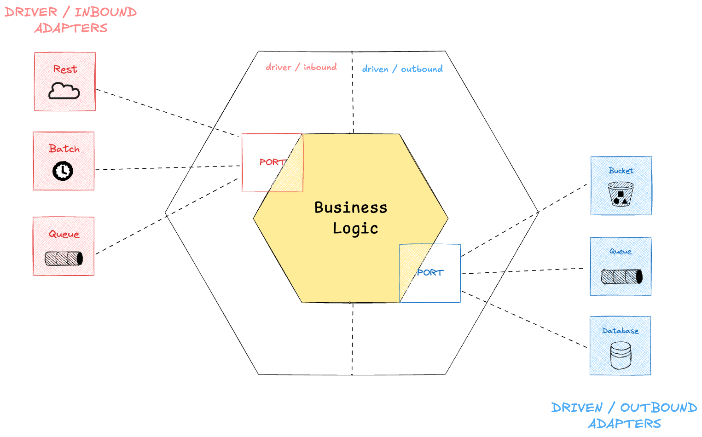

## Hexagonal Architecture 

Hexagonal Architecture is a software design pattern that emphasizes separation of concerns, testability, and flexible infrastructure integration. 

It focuses on isolating the core business logic from external systems like databases, UIs, and APIs.



#### Core domain 

This is the center of the hexagon, and contains : Business rules, Domain models, Application services (use cases).

It should not depend on any framework or external technology.

#### Ports (Interfaces)

Ports define how the application expects to interact with the outside world.

There are two types:

* Inbound Ports: Interfaces used to enter the application (e.g., use case interfaces, controller service interfaces)
* Outbound Ports: Interfaces the application uses to communicate outward (e.g., repository interfaces, messaging service interfaces)

#### Adapters

Adapters implement the ports.

There are two types:

* Inbound Adapters: Trigger the application (e.g., REST controllers, CLI handlers, message listeners)
* Outbound Adapters: Provide implementations for outbound ports (e.g., JPA repositories, REST clients, Kafka producers)

## Project structure 

```
├── domain
├────── entities
├────── inbound (ports)
├────── outbound (ports)
├────── services
├── infrastructure 
├───── inbound (adapters)
├──────── rest
├──────── queues
├──────── batches
├──────── cli
├──────── ...
├───── outbound (adapters)
├──────── database 
├──────── queues
├──────── bucket
├──────── ...
└── 
```

## Use case : Blogger 

Let's take a use case about designing a blogging platform that allow publish content in the form of posts.

In the traditional architecture we would found ourself with the current structure 

```
├── models
├────── Category
├────── Post
├── repositories
├────── CategoryRepository
├────── PostRepository
├── services
├────── CategoryService
├────── PostService
├── controllers
├────── PostController
├────── CategoryController
├── BloggerApplication
└── 
```

To apply the hexagonal architecture to current use case, we would end up with the following structure 

```
├── domain
├────── entities
├────────── Category
├────────── Post
├────── inbound
├────────── CreatePost
├────────── SearchPost
├────────── GetCategories
├────── outbound
├────────── CategoryInventory
├────────── PostInventory
├────── services
├────────── CategoryService
├────────── PostService
├── infrastructure
├────── inbound
├────────── rest
├────────────── CategoryRest
├────────────── PostRest
├────── outbound
├────────── database
├────────────── CategoryDatabaseInventory
├────────────── PostDatabaseInventory
├────── BloggerApplication
└── 
```

### Unit testing with in stubs (in memory adapter)

Whenever we write unit tests for our services, a common practice—especially in traditional layered architectures—is to mock the repository (or other external dependencies) using a library like Mockito. This allows us to isolate the unit under test and simulate various behaviors or responses from dependencies like databases, APIs, or message queues.

However, in hexagonal (or ports and adapters) architecture, it is encouraged to avoid mocking outbound ports directly in favor of using stub or in-memory implementations of the corresponding adapters.

Instead of mocking these interfaces using a mocking framework (which couples your tests to interaction details like method calls), hexagonal architecture suggests testing with real, but simple, implementations — like an in-memory adapter.

This makes your tests more faithful to real scenarios, while staying fast and isolated.

#### With mocks 
```java

private PostInventory inventory;
private PostService sut;

@BeforeEach
void setup() {
    inventory = mock();
    sut = new PostService(inventory);
}

@Test
void shouldReturnPostById() throws PostNotFoundByIdException {
    // Arrange
    UUID id = UUID.randomUUID();
    Post post = new Post("title1", "content1", new Category("category1"));
    when(inventory.findById(id)).thenReturn(Optional.of(post));
    // Act
    Post actual = sut.getById(id);
    // Assert
    assertThat(actual).isEqualTo(post);
}

@Test
void shouldThrowPostNotFoundByIdExceptionWhenGetByIdNotFoundId() {
    // Arrange
    UUID id = UUID.randomUUID();
    when(inventory.findById(id)).thenReturn(Optional.empty());
    // Act
    Throwable thrown = catchThrowable(() => sut.getById(id));
    // Assert
    assertThat(thrown).isInstanceOf(PostNotFoundByIdException.class)
            .hasMessage("Post with id " + id + " not found", exception.getMessage());
}
```

#### With stubs 
```java

private PostInventory inventory;
private PostService sut;

@BeforeEach
void setup() {
    inventory = new PostInMemoryInventory();
    sut = new PostService(inventory);
}

@Test
void shouldReturnPostById() throws PostNotFoundByIdException {
    // Arrange
    Post post = new Post(UUID.randomUUID(), "title1", "content1", new Category("category1"));
    inventory.create(post); // add post to in-memory inventory
    // Act
    Post actual = sut.getById(post.getId());
    // Assert
    assertThat(actual).isEqualTo(post);
}

@Test
void shouldThrowPostNotFoundByIdExceptionWhenGetByIdNotFoundId() {
    // Arrange
    UUID id = UUID.randomUUID();
    // Act
    Throwable thrown = catchThrowable(() => sut.getById(id));
    // Assert
    assertThat(thrown).isInstanceOf(PostNotFoundByIdException.class)
            .hasMessage("Post with id " + id + " not found", exception.getMessage());
}
```

with `PostInMemoryInventory` being 

```java
public class PostInMemoryInventory implements PostInventory {
    private final List<Post> posts;

    public PostInMemoryInventory() {
        this.posts = new ArrayList<>();
    }

    @Override
    public Post create(Post post) {
        if (post.getId() == null) {
            post.setId(UUID.randomUUID());
        }
        this.posts.add(post);
    }

    @Override
    public Optional<Post> findById(UUID id) {
        return posts.stream()
            .filter(post -> post.getId().equals(id))
            .findFirst();
    }
}
```

### Unit testing the architecture with ArchUnit 

In order to make sure that our domain doesn't communicate with external dependencies and doesn't rely on any framework, we can add the `archunit` to unit test our hexagonal architecture.

```xml
<dependency>
    <groupId>com.tngtech.archunit</groupId>
    <artifactId>archunit-junit5</artifactId>
    <version>${archunit.version}</version>
    <scope>test</scope>
</dependency>
```

And that way we can write our unit test for the architecture 

```java
package com.devt.blogger.domain;

import com.tngtech.archunit.junit.AnalyzeClasses;
import com.tngtech.archunit.junit.ArchTest;
import com.tngtech.archunit.lang.ArchRule;

import static com.tngtech.archunit.core.importer.ImportOption.DoNotIncludeTests;
import static com.tngtech.archunit.lang.syntax.ArchRuleDefinition.classes;

@AnalyzeClasses(
        packages = "com.devt.blogger",
        importOptions = DoNotIncludeTests.class
)
class DomainArchTest {

    @ArchTest
    static final ArchRule shouldNotDependsOnExternalClasses = classes()
            .that()
            .resideInAPackage("..domain..")
            .should()
            .onlyDependOnClassesThat()
            .resideInAnyPackage(
                    "com.devt.blogger.domain..",
                    "java.."
            );

}
```


## Resources 
- Traditional layer code : [`blogger-hexagonal/traditional`](https://github.com/elieahd/blogger-hexagonal/tree/traditional)
- Hexagonal layer code : [`blogger-hexagonal/hexagonal`](https://github.com/elieahd/blogger-hexagonal/tree/hexagonal)
- Article : [Transforming a Traditional Spring Boot App into a Hexagonal Architecture](https://medium.com/@eliedhr/transforming-a-traditional-spring-boot-app-into-a-hexagonal-architecture-0040b85add57)

