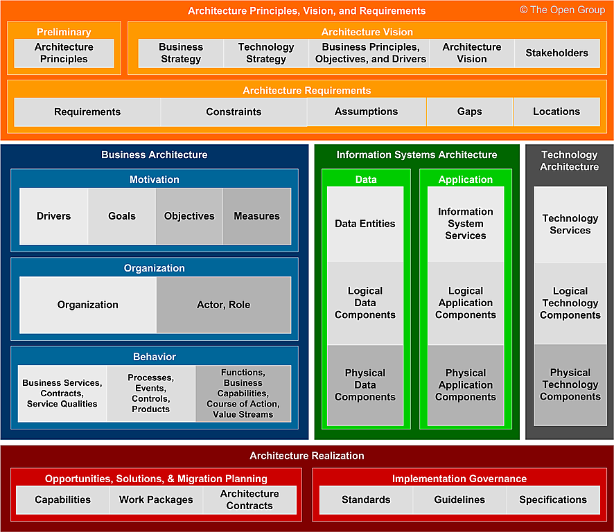

`Enterprise` is considered to be any collection of organizations that have common goals

`Enterprise Architecture` process of translating business vision and strategy into effective enterprise change by creating, communicating, and improving the key principles and models that describe the enterprise’s future state and enable its evolution

A good `Enterprise Architecture` facilitates effective governance, management, risk management, and exploitation opportunities

## Architecture Domains 

* `Business architecture` defines the business strategy, governance, organization, and key business processes
* `Data architecture` describes the structure of an organization’s logical and physical data assets and data management resources
* `Application architecture` provides a blueprint for the individual applications to be deployed, their interactions, and their relationships to the core business processes of the organization
* `Technology architecture` describes the digital architecture and the logical software and hardware infrastructure capabilities and standards that are required to support the deployment of business, data, and applications services

## Abstraction levels

* `Contextual` : understanding the environment in which an enterprise operates and the context in which architecture work is planned and executed. It answers why an enterprise undertakes architecture work, what is the scope of work, and the motivation in terms of goals, drivers, and objectives
* `Conceptual` : decomposing the requirements to understand the problem, and what is needed to address the problem, without unduly focusing on how the architecture will be realized
* `Logical` : Identifying the kinds of business, data, application, and technology components needed to achieve the services identified in the conceptual level. It is about identifying how an architecture can be organized and structured, in an implementation-independent fashion
* `Physical` : The allocation and implementation of physical components to meet the identified logical components. It is about determining with what physical components the logical-level components can be realized

## Content Framework Overview

The content framework provides a structure for the deliverables that are produced during each phase of the ADM. 

An `Enterprise Architecture Capability` is the ability to develop, use, and sustain the architecture of a particular enterprise, and use the architecture to govern change

