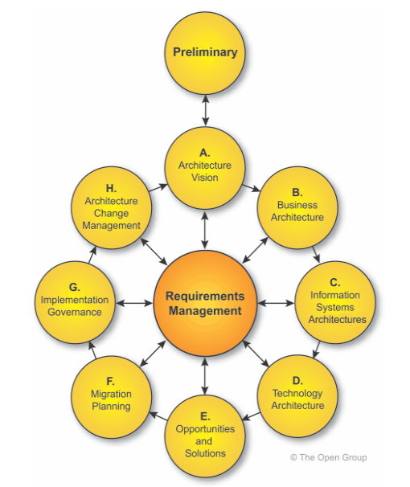

The `ADM`, Architecture Development Method, is a detailed step by step process for developing or changing an enterprise architecture (EA)

## Phases

### Preliminary Phase
The preparation and initiation activities required to create an Architecture Capability including customization of the TOGAF framework and definition of Architecture Principles

### Phase A: Architecture Vision
The initial phase of an architecture development cycle. Information about defining the scope of the architecture development initiative, identifying the stakeholders, creating the Architecture Vision, and obtaining approval to proceed with the architecture development

### Phase B: Business Architecture
Development of a Business Architecture to support the agreed Architecture Vision

### Phase C: Information Systems Architectures
Development of Information Systems Architectures to support the agreed Architecture Vision

### Phase D: Technology Architecture
Development of the Technology Architecture to support the agreed Architecture Vision

### Phase E: Opportunities & Solutions
Initial implementation planning and the identification of delivery vehicles for the architecture defined in the previous phases

### Phase F: Migration Planning
How to move from the Baseline to the Target Architectures by finalizing a detailed Implementation and Migration Plan

### Phase G: Implementation Governance
Architectural oversight of the implementation

### Phase H: Architecture Change Management
Procedures for managing change to the new architecture

### Requirements Management
Operates the process of managing architecture requirements throughout the ADM. It's a continuous phase which ensures that any changes to requirements are handled through appropriate governance processes and reflected in all other phases

