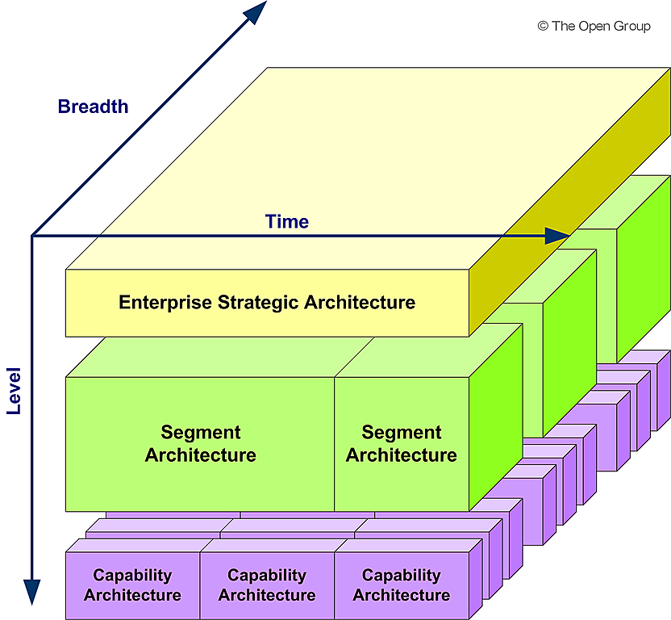

## Architecture Landscape

The architectural representation of assets in use, or planned, by the enterprise at particular points in time.

* Breadth: The subject matter covered by an Architecture Project 
* Level of Detail: The level of detail should be self-explanatory
* Time: Every architecture development project will have a planning horizon; the point in time when you expect to reach the Target Architecture

## Levels
| Level | Description |
| ----- | ----------- |
| Strategic Architecture | provides an organizing framework for operational and change activity and allows for direction setting at an executive level |
| Segment Architecture | provides an organizing framework for operational and change activity and allows for direction setting and the development of effective Architecture Roadmaps at a program or portfolio level |
| Capability Architecture | provides an organizing framework for change activity and the development of effective Architecture Roadmaps realizing capability increments |

## Four Purposes to Frame Architecture Projects

* Enterprise Architecture to Support Strategy: Deliver Enterprise Architecture to provide an end-to-end Target Architecture, and develop roadmaps of change over a three to ten-year period
* Enterprise Architecture to Support Portfolio: Deliver Enterprise Architecture to support cross-functional, multi-phase, and multi-project change initiatives
* Enterprise Architecture to Support Project: Deliver Enterprise Architecture to support the enterprise’s project delivery method
* Enterprise Architecture to Support Solution Delivery: Deliver Enterprise Architecture that is used to support the solution deployment

