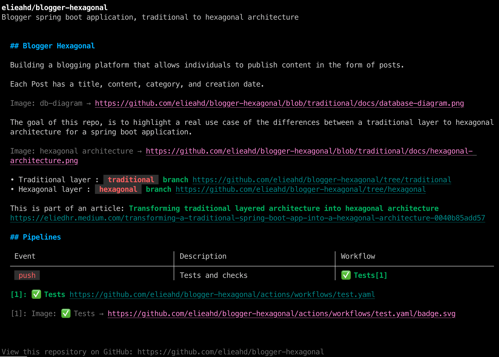
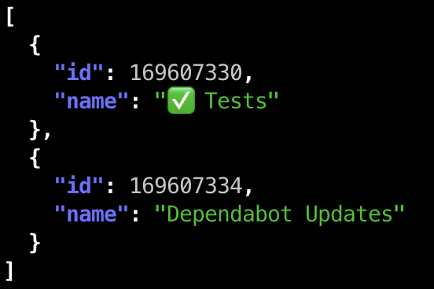
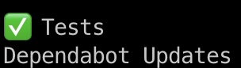

[GitHub CLI](https://cli.github.com/) brings GitHub to your terminal.

Here are some commands that you can try

### View Repo

```shell
gh repo view ${REPO}
```

This will allow you to see the repository description & `README.md` 

**Example** : View `elieahd/blogger-hexagonal`

```shell
gh repo view elieahd/blogger-hexagonal
```



### Workflows

```shell
gh workflow list --repo ${REPO}
```

**Example** : List workflows of the repo `elieahd/blogger-hexagonal`

```shell
gh workflow list --repo elieahd/blogger-hexagonal
```


**Example** : List workflows of the repo `elieahd/blogger-hexagonal` with formatted JSON output

```shell
gh workflow list --repo elieahd/blogger-hexagonal --json id,name
```


todo

**Example** : List workflows name of the repo `elieahd/blogger-hexagonal` 

```shell
gh workflow list --repo elieahd/blogger-hexagonal --json id,name -q '.[].name'
```



### Runs

```shell
gh run list --repo ${REPO} --workflow ${WORKFLOW}
```

**Example** : List workflows runs of `Dependabot Updates` in the repo `elieahd/blogger-hexagonal`

```shell
gh run list --repo elieahd/blogger-hexagonal --workflow 'Dependabot Updates'
```


### Pull Requests

```shell
gh pr list --repo ${REPO} --state open
```

**Example** : List all opened PRs on `elieahd/blogger-hexagonal`

```shell
gh pr list --repo elieahd/blogger-hexagonal --state open
```


**Example** : List all assigned PRs on `elieahd/blogger-hexagonal`

```shell
gh pr status --repo elieahd/blogger-hexagonal 
```


### Checks on PRs

```shell
gh pr checks ${PR} --repo ${REPO}
```

**Example** : List all checks on a specific PR on `elieahd/blogger-hexagonal`

```shell
gh pr checks 12 --repo elieahd/blogger-hexagonal
```


Here is the full list of [commands](https://cli.github.com/manual)
