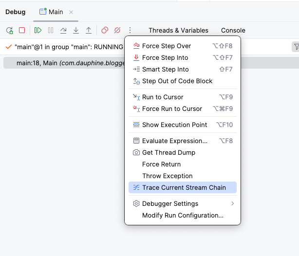
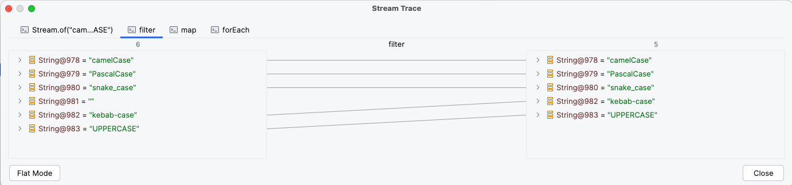
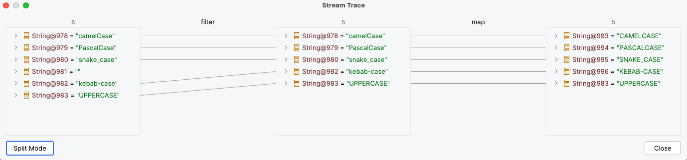

# Debugging a Java stream in IntelliJ

I just discovered a useful debugging feature that might help you one day!

In IntelliJ, you can debug a stream by setting a breakpoint on it and then clicking ‘Trace Current Stream Chain’ to visualize the flow.

For example, let’s say we have the following Java code:

``` java
import java.util.stream.Stream;

public class Main {

    public static void main(String[] args) {
        Stream.of(
                        "camelCase",
                        "PascalCase",
                        "snake_case",
                        "",
                        "kebab-case",
                        "UPPERCASE"
                )
                .filter(s -> !s.isBlank())
                .map(String::toUpperCase)
                .forEach(System.out::println);
    }
}
```

By clicking ‘Trace Current Stream Chain’ 



We can have a split mode of each step 



Or we can have a global flat mode


